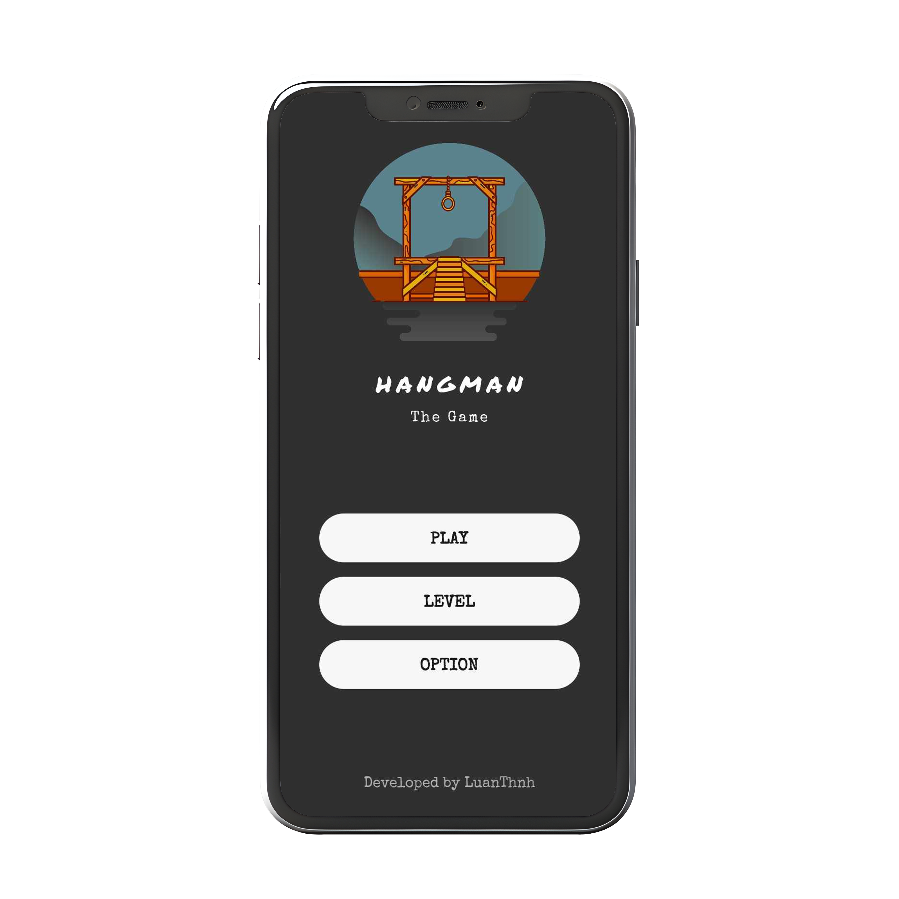
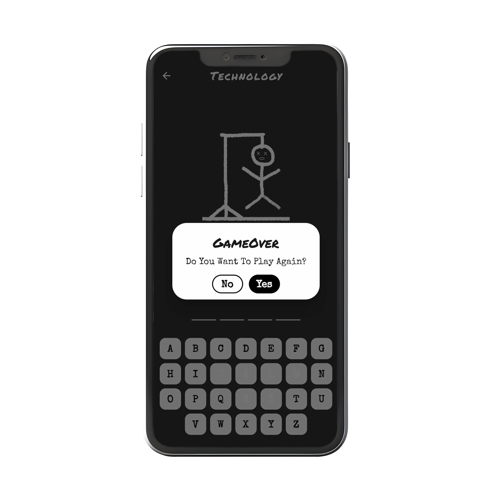
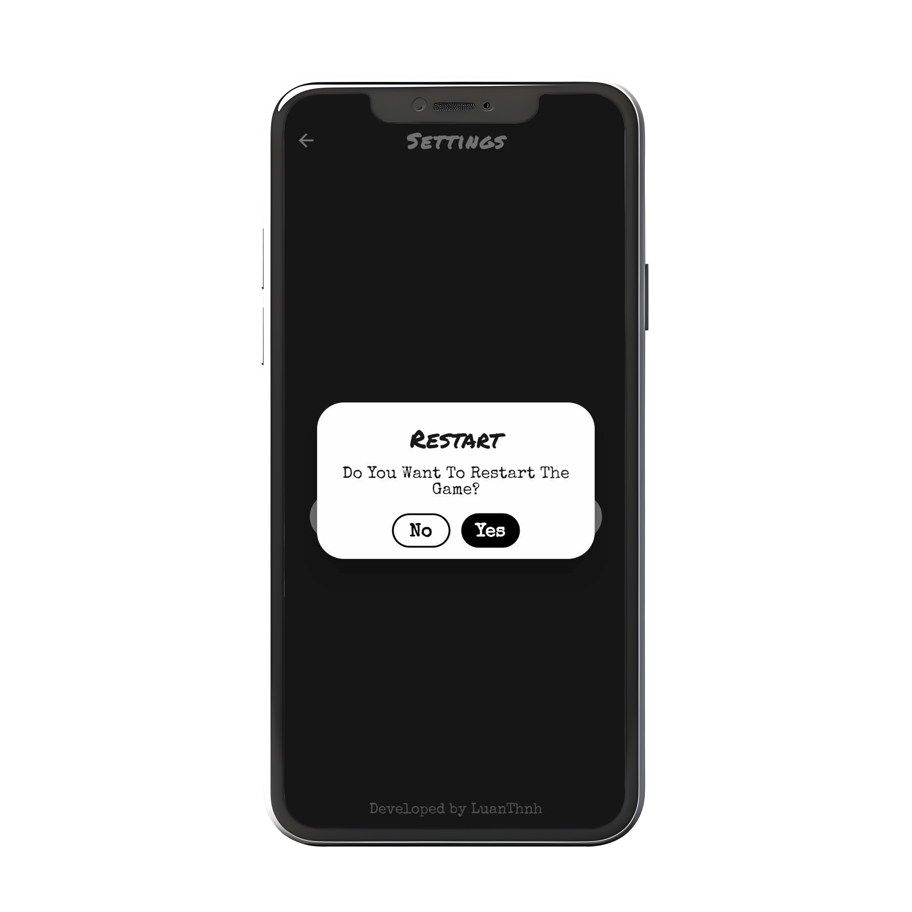

# Hangman Game using Flutter

This Flutter project implements the classic Hangman game, allowing users to guess a word letter by
letter. The game utilizes the Flutter framework and incorporates the `shared_preferences` package
for efficient data storage, providing a seamless user experience.

## Features

- **Hangman Gameplay**: Users can play the traditional Hangman game by guessing letters to reveal a
  hidden word.
- **Persistent Data Storage**: The `shared_preferences` package is used to store game data
  persistently, allowing users to resume games and track their progress.
- **Engaging UI**: The game features a visually appealing user interface with carefully designed
  screens to enhance the gaming experience.

## Prerequisites

- Ensure you have Flutter installed. If not, follow
  the [Flutter installation guide](https://flutter.dev/docs/get-started/install).
- Clone this repository to your local machine.

## Getting Started

1. **Clone the Project:**

   ```bash
   git clone https://github.com/luan-thnh/hangman.git
   cd hangman
   ```

2. **Open the Project:**

   - Open the project in your preferred Flutter development environment (e.g., VS Code, Android
     Studio).

3. **Fetch Dependencies:**
   Run the following command in the terminal to fetch the project dependencies:

   ```bash
   flutter pub get
   ```

4. **Connect a Device or Start an Emulator:**
   Connect a physical device or start an emulator on your machine.

5. **Run the App:**
   Run the app using the following command:
   ```bash
   flutter run
   ```

Now you have successfully cloned the project and set it up for development. Start playing the
Hangman game using Flutter!

## Usage

- Launch the app on your device or emulator.
- Start a new game and guess letters to uncover the hidden word.
- The game state is persistently stored using `shared_preferences`, allowing you to resume games.

Sure, here's an example of how you can structure the Screenshots section in your README.md file:

## Screenshots

### Splash Screen


### Home Screen



### Gameplay Screen


### GameOver Screen



### Next Screen


### Level Screen


### Option Screen


### Restart Screen



## Contributing

Feel free to contribute to the project by submitting bug reports, feature requests, or pull
requests. Your input is highly appreciated!

## License

This project is licensed under the MIT License - see the [LICENSE](LICENSE) file for details.
